# Klasifikasi Gambar Cuaca Berbasis Machine Learning dengan Deteksi Anomali

## Gambaran Umum Proyek

### Tujuan dan Sasaran
Proyek ini memiliki beberapa tujuan yang terbagi ke dalam tiga domain: teknis, akademis, dan fungsional.

**Tujuan Teknis:**
- Mengimplementasikan pipeline machine learning klasik secara end-to-end, mulai dari pengumpulan data hingga deployment aplikasi web.
- Mengembangkan dan membandingkan berbagai deskriptor fitur (feature descriptors) untuk tugas klasifikasi citra.
- Membangun arsitektur aplikasi web yang robust, modular, dan skalabel menggunakan Flask.
- Mengimplementasikan model deteksi anomali untuk meningkatkan ketahanan sistem terhadap input yang tidak valid.

**Tujuan Akademis:**
- Menyediakan studi kasus yang mendalam tentang penerapan teknik computer vision dan machine learning klasik pada masalah dunia nyata.
- Menganalisis secara kuantitatif dan kualitatif performa model Support Vector Machine (SVM) pada dataset citra yang kompleks.
- Menjelajahi metode untuk menginterpretasikan output probabilistik model untuk menghasilkan wawasan yang lebih kaya daripada sekadar prediksi kelas tunggal.

**Tujuan Fungsional:**
- Menciptakan sebuah aplikasi web yang fungsional dan ramah pengguna, yang memungkinkan siapa saja untuk mengklasifikasikan cuaca dari gambar.
- Menyediakan fitur-fitur canggih seperti pemrosesan gambar massal dan deteksi cuaca secara langsung (live) melalui kamera.

### Ruang Lingkup Proyek
Penting untuk mendefinisikan batasan dari sistem ini:
- **Fokus pada Klasifikasi, Bukan Prediksi**: Sistem ini mengklasifikasikan kondisi cuaca pada gambar yang ada (nowcasting), bukan memprediksi kondisi cuaca di masa depan.
- **Pendekatan Klasik**: Proyek ini sengaja menggunakan pendekatan machine learning klasik (rekayasa fitur + SVM) sebagai sarana edukasi dan perbandingan, bukan pendekatan deep learning (CNN) yang bersifat end-to-end.
- **Kelas Cuaca Terbatas**: Model dilatih pada empat kelas cuaca yang paling umum. Kondisi cuaca lain seperti badai petir, salju, atau tornado berada di luar cakupan saat ini.
- **Ketergantungan pada Kualitas Gambar**: Performa sistem sangat bergantung pada kualitas gambar input (resolusi, pencahayaan, tidak adanya halangan).
- **Prototipe, Bukan Produk Komersial**: Aplikasi yang dibangun adalah prototipe untuk demonstrasi dan tujuan akademis, belum dioptimalkan untuk skala produksi besar.

### Fitur Utama
- **Klasifikasi Multi-Kelas**: Mengklasifikasikan gambar ke dalam empat kategori cuaca:
  - **Cerah**: Langit yang jelas atau sedikit berawan, pencahayaan terang, bayangan yang tajam.
  - **Berawan**: Langit tertutup awan, pencahayaan lebih redup dan tersebar, bayangan lembut atau tidak ada.
  - **Hujan**: Tanda-tanda presipitasi seperti tetesan air, permukaan basah, kilau jalan, atau suasana gelap.
  - **Berkabut**: Jarak pandang terbatas, kontras rendah, objek di kejauhan kabur atau tidak terlihat.
- **Deteksi Anomali**: Sistem secara otomatis mengidentifikasi dan menolak gambar masukan yang tidak relevan (misalnya, potret, dokumen, gambar dalam ruangan) sebelum melakukan klasifikasi, untuk memastikan akurasi dan robustisitas.
- **Rekayasa Fitur Komprehensif**: Menggabungkan berbagai deskriptor fitur visual—bentuk, tekstur, warna, dan tepi—untuk menciptakan representasi numerik yang holistik dari setiap gambar.
- **Logika Prediksi Cerdas**: Tidak hanya mengambil kelas dengan probabilitas tertinggi, sistem juga menganalisis distribusi probabilitas untuk mengidentifikasi kondisi cuaca campuran atau ambigu, memberikan hasil yang lebih kontekstual dan informatif.
- **Antarmuka Web Interaktif**: Dibangun dengan Flask dan JavaScript, menyediakan fitur unggah gambar tunggal, unggah massal secara asinkron, dan deteksi langsung menggunakan kamera perangkat.

### Tumpukan Teknologi
- **Backend**: Python 3.9+ sebagai bahasa pemrograman utama. Flask dipilih sebagai kerangka kerja web karena sifatnya yang ringan, modular, dan sangat cocok untuk membangun API RESTful.
- **Machine Learning & Computer Vision**: Scikit-learn sebagai perpustakaan utama untuk implementasi model SVM, pipeline, dan metrik evaluasi. OpenCV dan Scikit-image digunakan untuk semua tugas pemrosesan citra dan ekstraksi fitur. NumPy menyediakan fondasi untuk operasi numerik yang efisien.
- **Frontend**: HTML5, CSS3, dan JavaScript (ES6+) standar. Fetch API digunakan untuk komunikasi asinkron dengan backend, memungkinkan pengalaman pengguna yang dinamis tanpa perlu memuat ulang halaman.

---

## Analisis dan Persiapan Dataset

### Sumber dan Akuisisi Data
Model dilatih menggunakan gabungan dari tiga dataset publik yang tersedia di Kaggle untuk memastikan keragaman data yang representatif:
- [multiclass-weather-dataset](https://www.kaggle.com/datasets/pratik2901/multiclass-weather-dataset)
- [weather-detection-image-dataset](https://www.kaggle.com/datasets/tamimresearch/weather-detection-image-dataset)
- [weather-dataset](https://www.kaggle.com/datasets/jehanbhathena/weather-dataset)

Proses akuisisi melibatkan pengunduhan, ekstraksi, dan penggabungan dataset. Sebuah skrip otomatis dibuat untuk menyatukan gambar dari direktori yang berbeda ke dalam satu struktur folder yang terorganisir per kelas, serta untuk menghapus duplikat.

### Analisis Data Eksploratif (EDA)
Sebelum melatih model, penting untuk memahami karakteristik data.

**Distribusi Data**:
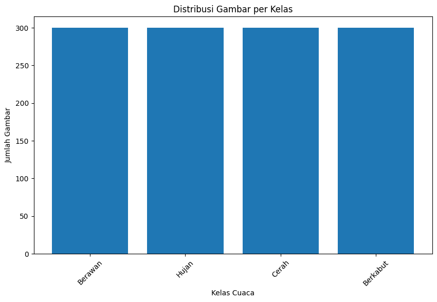
- Dataset dijaga agar seimbang (balanced), di mana setiap kelas memiliki jumlah sampel yang hampir sama. Ini krusial untuk mencegah model menjadi bias dan cenderung memprediksi kelas mayoritas.

**Karakteristik Visual per Kelas**:
- **Cerah**: Cenderung didominasi oleh warna biru (langit) dan hijau (vegetasi). Memiliki kontras tinggi dan bayangan yang tajam. Distribusi intensitas piksel cenderung lebih tinggi.
- **Berawan**: Palet warna lebih netral, dengan dominasi warna putih, abu-abu, dan biru pucat. Kontras lebih rendah dibandingkan kelas 'Cerah'.
- **Hujan**: Seringkali memiliki saturasi warna yang lebih rendah dan gambar yang lebih gelap secara keseluruhan. Adanya artefak visual seperti kilau pada permukaan basah dan blur akibat gerakan tetesan air menjadi ciri khas.
- **Berkabut**: Ciri utamanya adalah kontras yang sangat rendah dan hilangnya detail, terutama pada objek yang jauh. Saturasi warna sangat rendah, seringkali mendekati monokromatik.

**Contoh Gambar dari Setiap Kelas**:
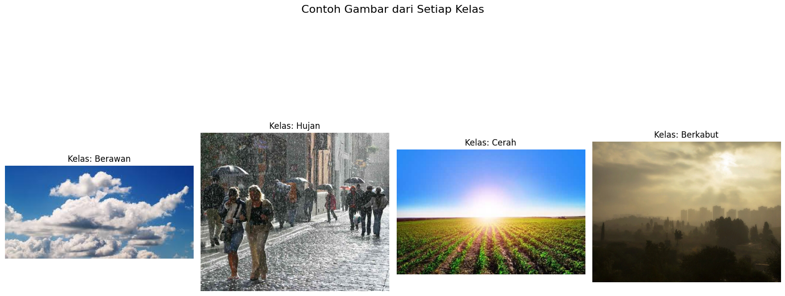

### Pembuatan Dataset Anomali
Untuk melatih model detektor anomali, sebuah dataset 'Anomali' dibuat secara manual. Tujuannya adalah untuk mengajarkan model seperti apa gambar yang "bukan cuaca". Dataset ini mencakup berbagai kategori gambar yang sengaja dipilih untuk menjadi out-of-distribution dari data cuaca, seperti:
- **Gambar Dalam Ruangan**: Ruang tamu, kantor, dapur.
- **Potret dan Manusia**: Foto wajah, orang-orang.
- **Dokumen dan Teks**: Screenshot halaman web, dokumen teks.
- **Hewan**: Foto close-up hewan.
- **Seni Abstrak dan Diagram**: Gambar yang tidak merepresentasikan objek dunia nyata.
- **Objek Tunggal**: Foto close-up objek seperti cangkir, laptop, dll.

Keberagaman ini penting agar detektor anomali dapat menggeneralisasi konsep "gambar non-cuaca" dengan baik.

## Arsitektur dan Desain Sistem

### Paradigma Desain dan Konsep Umum
Sistem ini dirancang menggunakan arsitektur Client-Server monolitik.
- **Client (Frontend)**: Antarmuka pengguna yang sepenuhnya berjalan di browser. Dibuat sebagai Single Page Application (SPA) secara de-facto, di mana interaksi pengguna ditangani oleh JavaScript untuk memanggil API backend dan memperbarui DOM secara dinamis.
- **Server (Backend)**: Aplikasi Flask monolitik yang menangani semua logika bisnis, termasuk otentikasi (jika ada), pemrosesan gambar, dan inferensi model machine learning. Pendekatan monolitik dipilih karena kesederhanaannya untuk proyek skala ini, menghindari kompleksitas overhead jaringan dari arsitektur microservices.

### Komponen Frontend
- **Struktur HTML**: Menggunakan HTML5 semantik. Terdiri dari beberapa halaman utama:
  - `index.html`: Halaman utama untuk unggah gambar tunggal dan massal.
  - `result.html`: Template untuk menampilkan hasil prediksi tunggal secara detail.
  - `result_batch.html`: Halaman untuk menampilkan galeri hasil prediksi massal.
  - `live.html`: Halaman untuk fitur deteksi langsung dari kamera.
- **Styling (CSS)**: Menggunakan file CSS kustom untuk memberikan tampilan yang bersih dan responsif. Desainnya mobile-first untuk memastikan kegunaan di berbagai ukuran layar.
- **Logika JavaScript**: Merupakan inti dari interaktivitas frontend.
  - **Penanganan Event**: Mendengarkan event seperti click pada tombol dan change pada input file.
  - **Komunikasi Asinkron**: Menggunakan Fetch API untuk mengirim data gambar ke backend dan menerima hasil JSON tanpa memblokir UI. Contoh logika untuk unggah massal:

```javascript
// Contoh pseudo-code untuk unggah massal asinkron
const files = fileInput.files;
const gallery = document.getElementById('gallery');

for (const file of files) {
    const formData = new FormData();
    formData.append('image', file);

    // Buat placeholder di UI
    const placeholder = createCardPlaceholder(file.name);
    gallery.appendChild(placeholder);

    // Kirim file ke API
    fetch('/api/predict', {
        method: 'POST',
        body: formData
    })
    .then(response => response.json())
    .then(data => {
        // Update placeholder dengan hasil prediksi
        updateCardWithResult(placeholder, data);
    })
    .catch(error => {
        // Tampilkan pesan error di card
        updateCardWithError(placeholder, error);
    });
}
```

  - **Manipulasi DOM**: Memperbarui halaman secara dinamis dengan hasil prediksi, menampilkan/menyembunyikan loader, dan merender pesan kesalahan.

### Komponen Backend (Server Flask)
- **API Endpoints**: Flask mengekspos beberapa endpoint RESTful:
  - **POST /predict/single**: Menerima satu file gambar, mengembalikan hasil prediksi dalam format HTML yang sudah dirender.
  - **POST /predict/batch**: Menerima daftar file gambar, mengembalikan hasil dalam format HTML.
  - **POST /api/predict**: Menerima satu file gambar, mengembalikan hasil prediksi dalam format JSON. Digunakan oleh fitur unggah massal dan deteksi langsung.
    - **Request**: `multipart/form-data` dengan field `image`.
    - **Response (Success)**: `{"status": "success", "prediction": "Cerah", "probabilities": {"Cerah": 0.85, ...}}`
    - **Response (Anomaly)**: `{"status": "anomaly_detected", "message": "Gambar tidak terdeteksi sebagai pemandangan cuaca."}`
    - **Response (Error)**: `{"status": "error", "message": "Pesan error"}`
- **Model Wrapper Class**: Logika machine learning dienkapsulasi dalam sebuah kelas `ModelWrapper` untuk mematuhi prinsip Single Responsibility. Kelas ini bertanggung jawab untuk:
  - Memuat model klasifikasi dan detektor anomali dari file `.pkl` saat aplikasi dimulai.
  - Menyimpan objek prapemrosesan (misalnya, `StandardScaler`, `PCA`).
  - Menyediakan satu metode `predict(image)` yang mengorkestrasi seluruh alur kerja: prapemrosesan, ekstraksi fitur, deteksi anomali, dan klasifikasi.

### Diagram Desain UML
#### Diagram Kasus Penggunaan (Use Case)
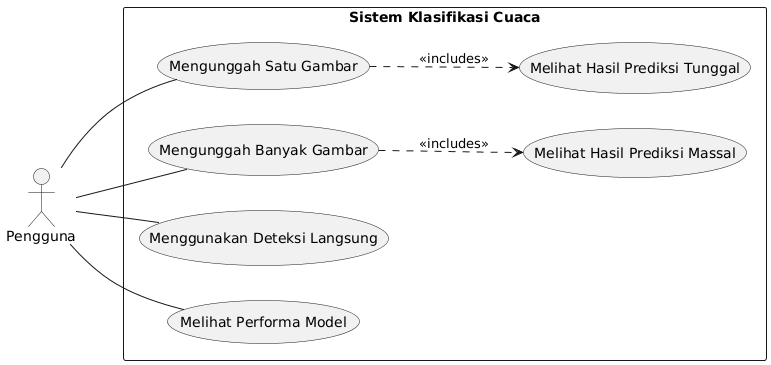
Diagram ini mengilustrasikan interaksi fungsional antara pengguna (actor) dan sistem:
- **Mengunggah Satu Gambar**: Pengguna memilih satu file, sistem memprosesnya dan menampilkan halaman hasil yang detail, termasuk probabilitas kelas dan interpretasi cerdas.
- **Mengunggah Banyak Gambar**: Pengguna memilih beberapa file. Antarmuka menampilkan galeri placeholder, dan setiap gambar diproses secara independen di latar belakang. Hasilnya mengisi placeholder satu per satu saat tersedia.
- **Menggunakan Deteksi Langsung**: Pengguna memberikan izin akses kamera. Frontend menangkap frame video, mengirimkannya ke backend, dan menampilkan prediksi sebagai overlay secara real-time.
- **Melihat Performa Model**: Pengguna dapat mengakses halaman statis yang menampilkan visualisasi metrik performa model (Confusion Matrix, ROC, dll.) yang dihasilkan saat evaluasi offline.

#### Diagram Komponen
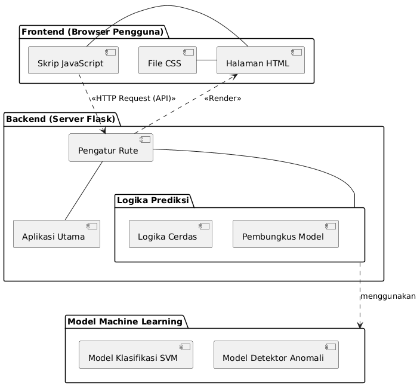
Diagram ini memvisualisasikan organisasi modul perangkat lunak dan dependensinya:
- **Frontend**: Berinteraksi dengan backend melalui HTTP Request. Tidak memiliki logika bisnis.
- **Backend**:
  - **Pengatur Rute (app.py)**: Bertindak sebagai titik masuk, mengarahkan permintaan ke controller yang sesuai.
  - **Logika Prediksi**: Modul inti tempat semua pemrosesan terjadi.
  - **Pembungkus Model**: Berinteraksi langsung dengan file model ML yang tersimpan.
  - **Logika Cerdas**: Modul pasca-pemrosesan yang menganalisis output mentah dari model.
  - **Model Machine Learning**: Artefak biner (.pkl) yang merupakan hasil dari proses pelatihan offline. Mereka diperlakukan sebagai dependensi oleh backend.

#### Diagram Aktivitas
Diagram ini menggambarkan alur kerja dinamis langkah demi langkah:
- Alur Prediksi Gambar Tunggal
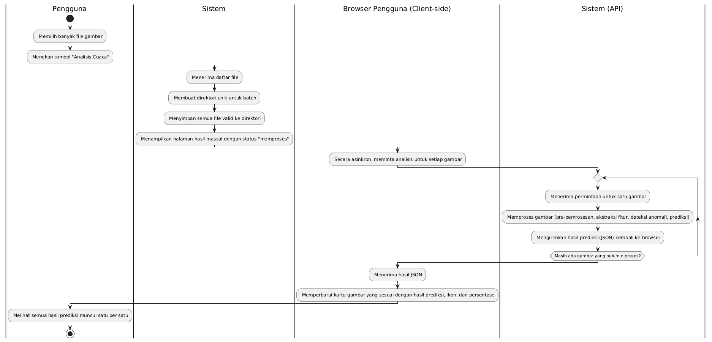
- Alur Prediksi Gambar Massal

- Alur Deteksi Langsung (Real-time)
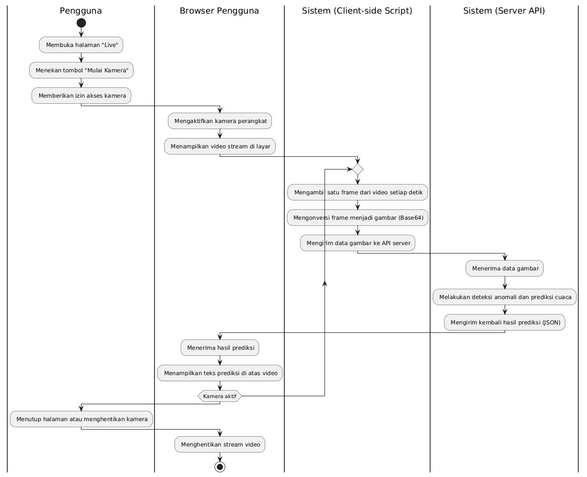

---

## Metodologi Machine Learning Mendalam

### Alur Kerja Prediksi Dua Tahap
Setiap gambar yang diunggah harus melewati proses penyaringan dua tahap yang robust:
- **Tahap 1: Deteksi Anomali**: Gambar pertama kali dianalisis oleh Model Detektor Anomali. Tujuannya adalah untuk menjawab pertanyaan: "Apakah gambar ini merupakan pemandangan luar ruangan yang relevan untuk klasifikasi cuaca?". Jika ya, proses berlanjut. Jika tidak (misalnya, potret atau dokumen), gambar ditolak dan proses berhenti.
- **Tahap 2: Klasifikasi Cuaca**: Hanya jika gambar lolos tahap pertama, vektor fiturnya akan diteruskan ke Model Klasifikasi Utama. Model ini kemudian menjawab pertanyaan: "Jika ini adalah gambar cuaca, apa kondisi spesifiknya (Cerah, Berawan, Hujan, atau Berkabut)?".  
Pendekatan ini secara signifikan mengurangi kemungkinan prediksi yang tidak masuk akal pada data out-of-distribution (OOD).

### Prapemrosesan Citra
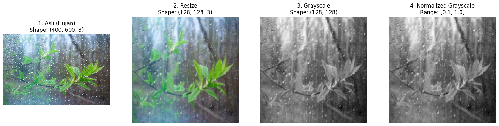
Tujuan dari prapemrosesan adalah untuk menstandarisasi input dan menghilangkan variasi yang tidak relevan yang dapat membingungkan model:
- **Pengubahan Ukuran (Resizing)**: Gambar diubah ukurannya menjadi 128x128 piksel. Ukuran ini dipilih sebagai kompromi antara mempertahankan detail spasial yang cukup untuk analisis fitur dan menjaga agar dimensi vektor fitur tetap terkendali, sehingga mempercepat komputasi. Interpolasi yang digunakan adalah `cv2.INTER_AREA`, yang direkomendasikan untuk mengecilkan gambar karena dapat menghindari artefak moiré.
- **Konversi Ruang Warna**: Gambar dikonversi ke skala keabuan (grayscale) karena banyak deskriptor tekstur dan bentuk (seperti HOG, LBP, GLCM) beroperasi pada informasi intensitas, bukan warna. Ini membuat fitur lebih tahan terhadap variasi pencahayaan. Salinan gambar dalam ruang warna lain (HSV dan Lab) tetap disimpan untuk ekstraksi fitur warna secara terpisah.
- **Normalisasi**: Nilai piksel, yang awalnya berada dalam rentang integer [0, 255], dinormalisasi menjadi rentang float [0.0, 1.0]. Ini adalah langkah penting karena model seperti SVM sensitif terhadap skala fitur. Normalisasi memastikan bahwa semua piksel memiliki skala yang sama, mencegah fitur dengan rentang nilai besar mendominasi proses pembelajaran.

### Rekayasa Fitur (Feature Engineering)
Ini adalah inti dari pendekatan machine learning klasik, di mana kita secara eksplisit mendesain dan mengekstrak fitur-fitur informatif dari data mentah.

#### Fitur Bentuk: Histogram of Oriented Gradients (HOG)
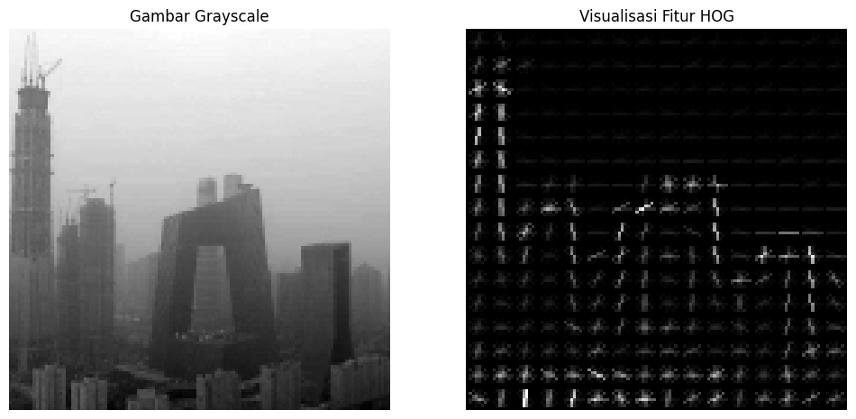
**Prinsip Kerja**:
- HOG menangkap distribusi gradien orientasi (tepi) lokal.
- Gambar dibagi menjadi sel-sel kecil (misalnya, 8x8 piksel).
- Untuk setiap piksel di dalam sel, gradien (magnitudo dan arah) dihitung.
- Sebuah histogram orientasi (misalnya, 9 bin) dibuat untuk setiap sel, di mana setiap piksel memberikan "suara" ke bin orientasi yang sesuai, dibobot oleh magnitudonya.
- Sel-sel dikelompokkan menjadi blok-blok yang lebih besar dan tumpang tindih (misalnya, 2x2 sel).
- Histogram dari sel-sel dalam satu blok digabungkan dan dinormalisasi (L2-norm) untuk membuatnya tahan terhadap perubahan kontras dan iluminasi.
- Vektor hasil normalisasi dari semua blok digabungkan menjadi satu vektor fitur HOG akhir.

**Contoh Kode**:
```python
from skimage.feature import hog

features, hog_image = hog(
    gray_image,
    orientations=9,
    pixels_per_cell=(8, 8),
    cells_per_block=(2, 2),
    visualize=True,
    block_norm='L2-Hys'
)
```

#### Fitur Tekstur: Local Binary Patterns (LBP)
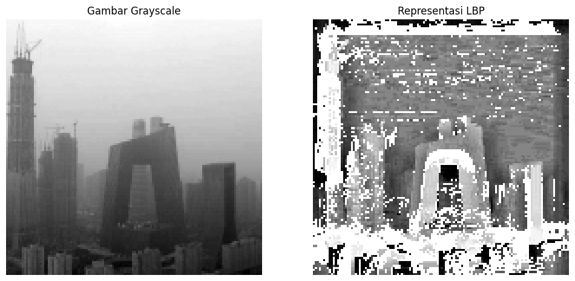
**Prinsip Kerja**:
- LBP adalah deskriptor tekstur yang kuat dan efisien secara komputasi.
- Untuk setiap piksel dalam gambar, sebuah lingkungan 3x3 di sekitarnya diambil.
- Intensitas piksel tetangga dibandingkan dengan piksel tengah. Jika intensitas tetangga lebih besar atau sama, diberi nilai 1; jika tidak, 0.
- Hasilnya adalah 8 digit biner, yang kemudian diubah menjadi satu nilai desimal (0-255).
- Proses ini diulangi untuk semua piksel, menghasilkan gambar LBP.
- Sebuah histogram dari gambar LBP ini dihitung untuk mendapatkan vektor fitur. Varian uniform LBP sering digunakan untuk mengurangi panjang vektor dengan mengelompokkan pola-pola yang jarang terjadi.

**Contoh Kode**:
```python
from skimage.feature import local_binary_pattern

radius = 3
n_points = 8 * radius
lbp = local_binary_pattern(gray_image, n_points, radius, method='uniform')
hist, _ = np.histogram(lbp.ravel(), bins=np.arange(0, n_points + 3), range=(0, n_points + 2))
hist = hist.astype("float")
hist /= (hist.sum() + 1e-6) # Normalisasi
```

#### Fitur Warna: Color Histograms & Color Moments
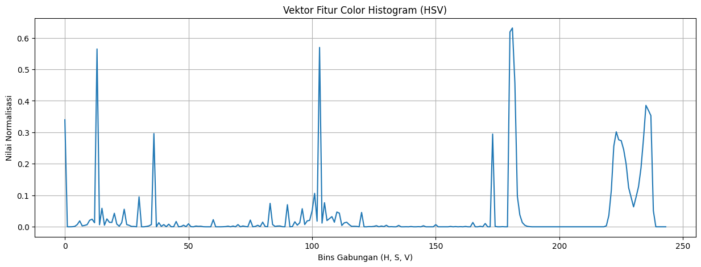
- **Histogram Warna (HSV)**:
  - Daripada menggunakan RGB yang sangat berkorelasi dengan pencahayaan, kita menggunakan HSV.
    - **Hue (H)**: Warna murni (merah, hijau, biru).
    - **Saturation (S)**: Intensitas/kemurnian warna.
    - **Value (V)**: Kecerahan warna.
  - Histogram 3D (H, S, V) dihitung dan kemudian diratakan menjadi vektor 1D. Ini menangkap distribusi warna dominan dalam gambar.
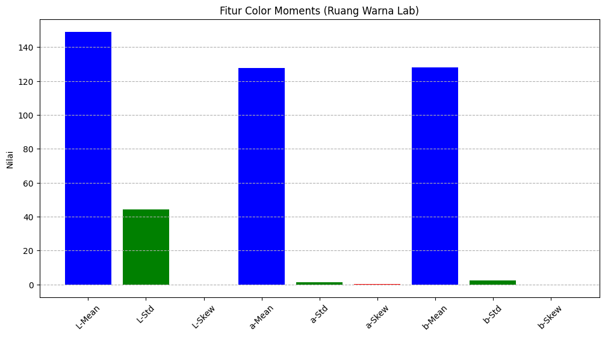
- **Momen Warna (Lab)**:
  - Ruang warna Lab dirancang agar lebih sesuai dengan persepsi visual manusia.
    - **L***: Lightness (Kecerahan).
    - **a***: Sumbu hijau ke merah.
    - **b***: Sumbu biru ke kuning.
  - Untuk setiap channel (L, a, b), tiga momen statistik dihitung:
    - **Mean**: Rata-rata warna, menunjukkan warna dominan.
    - **Standard Deviation**: Sebaran warna, menunjukkan variasi warna.
    - **Skewness**: Kemiringan distribusi warna.
  - Ini menghasilkan vektor 9-dimensi yang ringkas namun informatif.

#### Fitur Tekstur Lanjut: GLCM & Gabor Filters
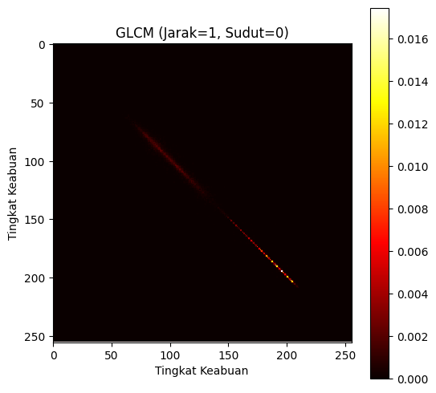
- **Gray-Level Co-occurrence Matrix (GLCM)**:
  - Menganalisis hubungan spasial antar piksel. GLCM adalah matriks yang menghitung seberapa sering pasangan piksel dengan nilai intensitas tertentu muncul dalam gambar pada jarak dan sudut tertentu.
  - Dari matriks ini, properti statistik diekstraksi:
    - **Contrast**: Ukuran variasi lokal.
    - **Dissimilarity**: Seberapa berbeda elemen-elemen dalam matriks.
    - **Homogeneity**: Seberapa dekat distribusi elemen ke diagonal GLCM.
    - **Energy/ASM**: Jumlah kuadrat elemen, mengukur keseragaman.
    - **Correlation**: Ukuran korelasi linear antar piksel.
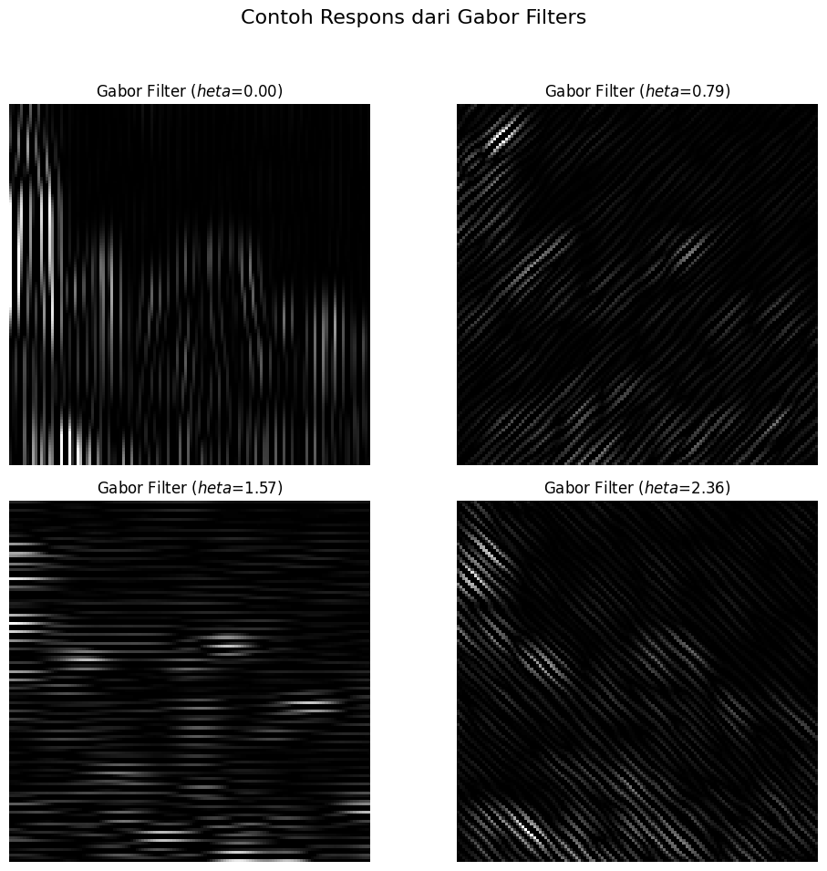
- **Filter Gabor**:
  - Ini adalah bank filter linear yang responsnya terhadap gambar memberikan informasi tentang keberadaan frekuensi dan orientasi tertentu.
  - Dengan menerapkan serangkaian filter Gabor dengan orientasi dan frekuensi yang berbeda, kita dapat membuat sidik jari tekstur yang kaya untuk gambar tersebut.

#### Fitur Tepi: Filter Sobel
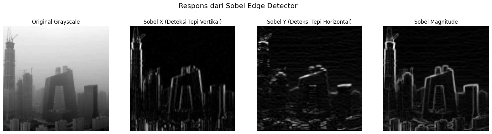
- Operator Sobel menggunakan konvolusi dengan dua kernel (satu untuk sumbu x, satu untuk sumbu y) untuk menghitung aproksimasi turunan.
- Ini menyoroti area dengan perubahan intensitas yang cepat, yaitu tepi.
- Magnitudo gradien (akar dari Gx^2 + Gy^2) memberikan kekuatan tepi.
- Histogram dari magnitudo ini memberikan deskripsi tentang "ketajaman" atau "keburaman" gambar.

### Reduksi Dimensi: Principal Component Analysis (PCA)
- **Masalah**: Vektor fitur gabungan memiliki dimensi sangat tinggi (>8000), yang dapat menyebabkan curse of dimensionality, overfitting, dan waktu pelatihan yang lama. Banyak dari fitur ini mungkin juga redundan (berkorelasi tinggi).
- **Solusi**: PCA adalah teknik transformasi linear yang memproyeksikan data ke sistem koordinat baru. Sumbu-sumbu baru ini, yang disebut principal components, diurutkan berdasarkan jumlah varians data yang mereka tangkap.
- **Implementasi**: Dengan memilih untuk mempertahankan komponen yang menjelaskan 95% dari total varians, kita dapat secara drastis mengurangi jumlah dimensi sambil meminimalkan kehilangan informasi. Ini secara efektif menghilangkan noise dan hanya menyimpan sinyal yang paling penting dari data.

### Model Klasifikasi: Support Vector Machine (SVM)
- **Intuisi Geometris**: SVM bekerja dengan menemukan hyperplane (garis dalam 2D, bidang dalam 3D) yang paling baik memisahkan titik data dari kelas yang berbeda. "Paling baik" didefinisikan sebagai hyperplane yang memiliki margin atau "jalan" terlebar antara dirinya dan titik data terdekat dari setiap kelas. Titik-titik data yang berada di tepi margin ini disebut support vectors, karena mereka adalah satu-satunya titik yang "mendukung" atau mendefinisikan posisi hyperplane.
- **Kernel Trick (RBF)**: Untuk masalah yang tidak dapat dipisahkan secara linear, SVM menggunakan kernel trick. Kernel RBF (Radial Basis Function) bekerja dengan memetakan data secara implisit ke ruang berdimensi tak hingga. Di ruang baru ini, ia mengukur kesamaan antara dua titik: dua titik dianggap "dekat" jika mereka dekat dalam ruang fitur asli. Ini memungkinkan SVM untuk membuat batas keputusan non-linear yang sangat kompleks di ruang asli.
- **Hyperparameter Tuning**:
  - **C (Regularization Parameter)**: Mengontrol trade-off antara mencapai margin yang lebar dan meminimalkan kesalahan klasifikasi pada data latih. C yang rendah memungkinkan margin yang lebih lebar dan lebih banyak kesalahan (model lebih umum, risiko underfitting). C yang tinggi mencoba mengklasifikasikan setiap titik dengan benar, menghasilkan margin yang lebih sempit dan risiko overfitting.
  - **gamma**: Mendefinisikan seberapa besar pengaruh satu sampel pelatihan. gamma yang rendah berarti pengaruhnya jauh (batas keputusan lebih mulus). gamma yang tinggi berarti pengaruhnya dekat (batas keputusan lebih "bergelombang" dan dapat sangat dipengaruhi oleh titik data individual, berisiko overfitting).

---

## Proses Pelatihan Model

### Augmentasi Data
Untuk meningkatkan generalisasi model dan mencegah overfitting, augmentasi data diterapkan hanya pada data latih. Ini melibatkan pembuatan versi modifikasi dari gambar yang ada secara artifisial:
- **Horizontal Flip**: Menciptakan cerminan gambar. Berguna karena cuaca tidak bergantung pada orientasi kiri-kanan.
- **Random Rotation**: Memutar gambar dengan sudut kecil. Membantu model menjadi invarian terhadap sedikit perubahan sudut kamera.
- **Sharpening**: Menajamkan gambar untuk menonjolkan detail tekstur.

### Pipeline Pelatihan Scikit-learn
Untuk memastikan alur kerja yang bersih dan mencegah data leakage (misalnya, menerapkan PCA yang dilatih pada data uji ke data latih), seluruh proses (penskalaan, PCA, klasifikasi) dibungkus dalam `sklearn.pipeline.Pipeline`.

```python
from sklearn.pipeline import Pipeline
from sklearn.preprocessing import StandardScaler
from sklearn.decomposition import PCA
from sklearn.svm import SVC

# Membuat pipeline
pipeline = Pipeline([
    ('scaler', StandardScaler()),         # Langkah 1: Penskalaan fitur
    ('pca', PCA(n_components=0.95)),      # Langkah 2: Reduksi dimensi
    ('svc', SVC(kernel='rbf', probability=True)) # Langkah 3: Klasifikasi
])
```

Pipeline ini memastikan bahwa `StandardScaler` dan `PCA` "dipelajari" hanya dari data latih selama validasi silang dan pelatihan akhir.

### Pencarian Hyperparameter Otomatis
Menemukan kombinasi `C` dan `gamma` yang optimal sangat penting.
- **Validasi Silang (k-Fold Cross-Validation)**: Data latih dibagi menjadi k lipatan (misalnya, k=5). Model dilatih pada k-1 lipatan dan dievaluasi pada lipatan yang tersisa. Proses ini diulangi k kali, dengan setiap lipatan menjadi set validasi sekali. Rata-rata performa dari k iterasi memberikan estimasi yang lebih robust tentang kinerja model.
- **GridSearchCV**: Teknik ini secara sistematis mencoba setiap kombinasi hyperparameter yang ditentukan dalam sebuah grid. Meskipun komprehensif, ini bisa sangat lambat. Oleh karena itu, pencarian grid ini dilakukan pada subset kecil dari data latih untuk mempercepat proses.
- **RandomizedSearchCV**: Digunakan untuk detektor anomali, teknik ini mencoba sejumlah kombinasi acak dari ruang hyperparameter, yang seringkali jauh lebih efisien dan memberikan hasil yang sebanding.

### Detail Alur Pelatihan
- **Model Klasifikasi Utama**
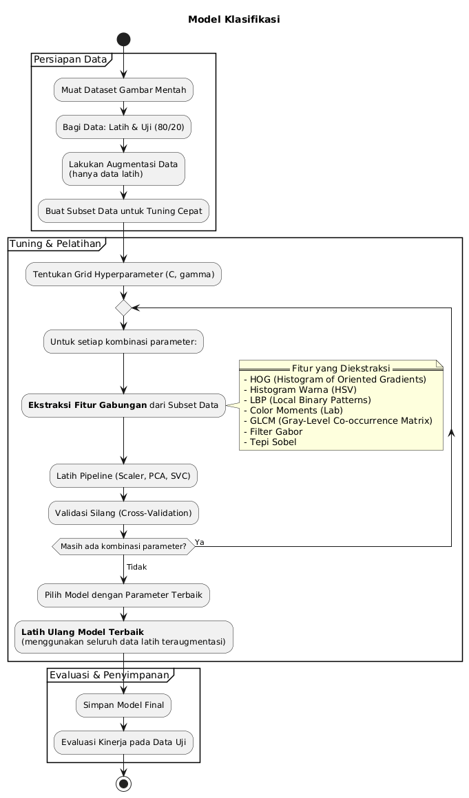
- **Model Detektor Anomali**
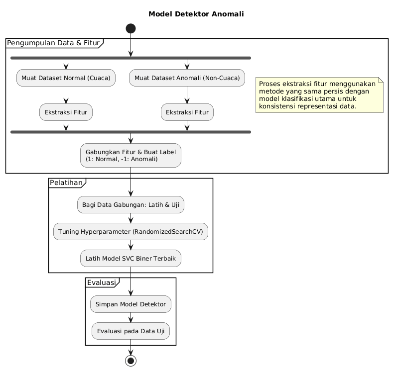

---

## Evaluasi Performa Model

### Metrik Model Klasifikasi Utama
#### Confusion Matrix
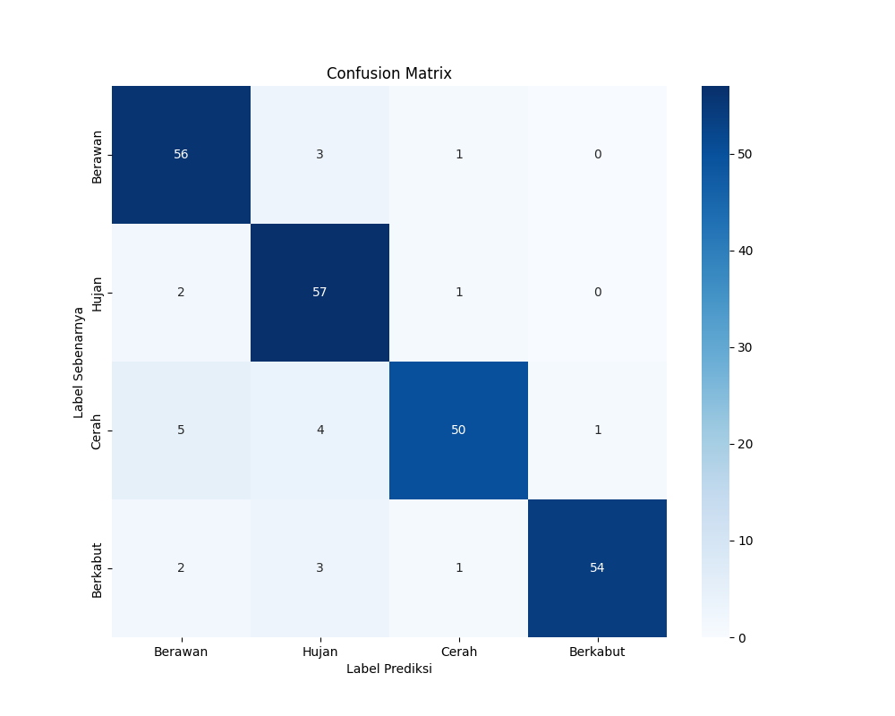
**Interpretasi Mendalam**: Matriks ini menunjukkan bahwa model sangat akurat. Kelas "Berawan" dan "Hujan" memiliki performa terbaik. Kesalahan yang paling sering terjadi adalah antara "Cerah" dan kelas lain ("Berawan", "Hujan"), yang secara visual dapat dimengerti—misalnya, gambar matahari terbenam yang cerah bisa memiliki warna oranye dan merah yang mirip dengan awan badai.

#### Laporan Klasifikasi
**Akurasi Keseluruhan**: 0.9042

**Laporan Klasifikasi**:
```
              precision    recall  f1-score   support
     Berawan       0.86      0.93      0.90        60
       Hujan       0.85      0.95      0.90        60
       Cerah       0.94      0.83      0.88        60
    Berkabut       0.98      0.90      0.94        60
```
- **Precision (Presisi)**: Dari semua yang diprediksi sebagai 'Berkabut', 98% di antaranya benar-benar berkabut. Ini adalah metrik penting jika biaya dari false positive tinggi.
- **Recall (Sensitivitas)**: Model berhasil menemukan 95% dari semua gambar 'Hujan' yang sebenarnya. Ini penting jika biaya dari false negative tinggi (misalnya, melewatkan kondisi berbahaya).
- **F1-Score**: Rata-rata harmonik dari presisi dan recall. Skor yang tinggi di semua kelas menunjukkan model yang seimbang.

#### Kurva ROC dan AUC
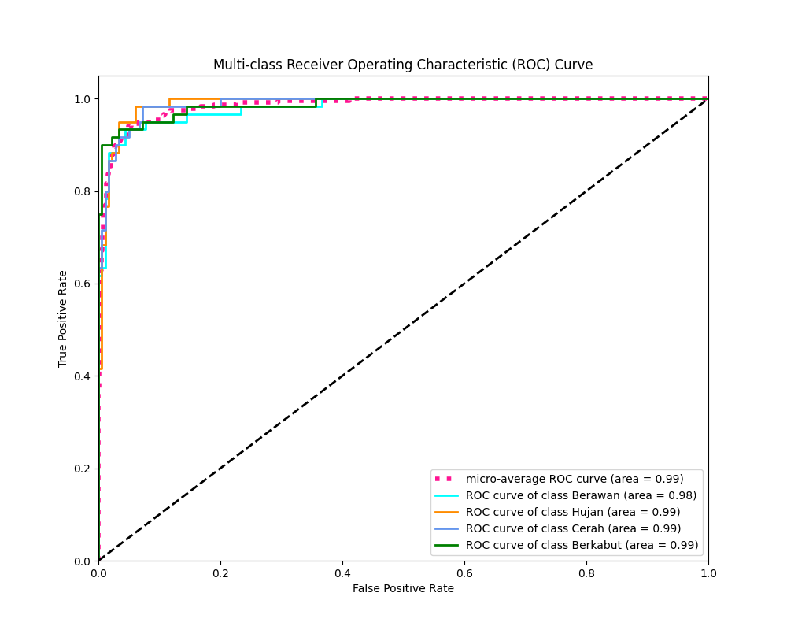
**Interpretasi**: Area di Bawah Kurva (AUC) untuk semua kelas mendekati 1.0. Ini berarti jika kita memilih satu gambar positif dan satu gambar negatif secara acak, model memiliki probabilitas 98-99% untuk memberi skor yang lebih tinggi pada gambar positif. Ini menunjukkan daya pemisah yang sangat baik.

#### Kurva Precision-Recall
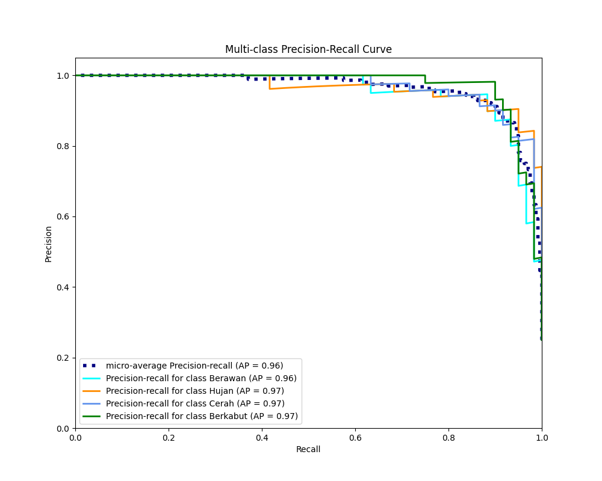
**Interpretasi**: Kurva yang tetap berada di dekat sudut kanan atas (presisi=1.0, recall=1.0) adalah ideal. Nilai Average Precision (AP) yang tinggi (0.96-0.97) menunjukkan bahwa model dapat mempertahankan presisi yang tinggi bahkan ketika mencoba untuk mengidentifikasi sebagian besar sampel positif (recall tinggi).

### Metrik Model Detektor Anomali
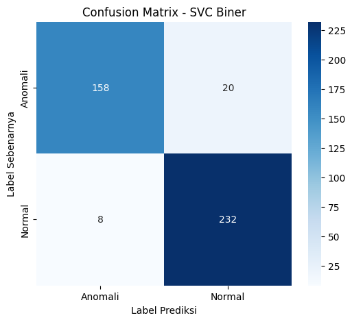
**Interpretasi**: Model ini sangat efektif sebagai "penjaga gerbang". Ia memiliki tingkat recall yang tinggi untuk kelas normal (232/240 = 96.7%), yang berarti ia jarang salah menolak gambar cuaca yang valid. Tingkat precision-nya untuk kelas normal juga tinggi (232/252 = 92.1%), artinya sebagian besar yang diloloskan memang gambar cuaca.

### Analisis Kualitatif dan Studi Kasus Kegagalan
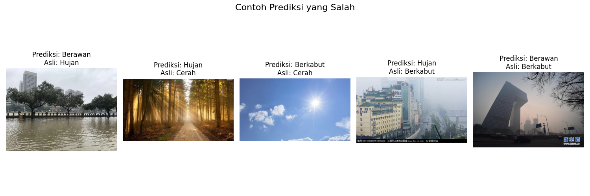
**Analisis Kegagalan**:
- **Prediksi: Berawan, Asli: Hujan**: Gambar ini menunjukkan genangan air, tetapi langitnya terlihat seperti mendung biasa tanpa tetesan hujan yang jelas. Model mungkin lebih fokus pada tekstur langit.
- **Prediksi: Hujan, Asli: Cerah**: Gambar ini memiliki kontras yang sangat tinggi antara cahaya matahari yang menembus pohon dan area bayangan yang gelap. Pola cahaya dan bayangan yang kompleks ini mungkin disalahartikan sebagai tekstur hujan atau permukaan basah.
- **Prediksi: Berkabut, Asli: Cerah**: Matahari yang sangat terang menyebabkan lens flare dan membuat sebagian besar langit menjadi putih, menurunkan kontras secara keseluruhan, yang merupakan ciri khas kabut.

---

## Logika Prediksi Cerdas

### Pengukuran Ketidakpastian dengan Entropi Shannon
- **Konsep**: Entropi Shannon adalah ukuran ketidakpastian dalam sebuah distribusi probabilitas. Formulanya adalah:  
  `H(X) = -Σ p(x) log₂(p(x))`.
- **Implementasi**: Setelah mendapatkan vektor probabilitas dari SVM (misalnya, [0.40, 0.35, 0.15, 0.10] untuk [Berawan, Hujan, Cerah, Berkabut]), kita hitung entropinya.
  - **Entropi Rendah (Keyakinan Tinggi)**: Vektor [0.95, 0.02, 0.02, 0.01] akan memiliki entropi yang sangat rendah.
  - **Entropi Tinggi (Ketidakpastian)**: Vektor [0.40, 0.35, 0.15, 0.10] akan memiliki entropi yang tinggi.
- **Logika**: Jika entropi yang dihitung melebihi ambang batas yang ditentukan secara empiris (misalnya, dari mengamati distribusi entropi pada set validasi), sistem tidak akan memaksakan satu prediksi. Sebaliknya, ia akan melaporkan "Cuaca Campuran" dan menampilkan dua kelas teratas beserta probabilitasnya.

### Aturan Berbasis Domain untuk Kondisi Hibrida
Ini adalah lapisan logika tambahan yang diterapkan setelah prediksi probabilitas:
- **Jika "Cerah" dan "Berawan" adalah dua probabilitas teratas**: Kondisi ini sangat umum dan dideskripsikan sebagai "Cerah Berawan".
- **Jika "Berawan" dan "Hujan" adalah dua teratas**: Ini menunjukkan kondisi "Mendung" yang kemungkinan besar akan atau sedang hujan.
- **Jika "Hujan", "Berkabut", dan "Berawan" memiliki probabilitas tinggi**: Ini adalah deskripsi yang baik untuk kondisi "Hujan Berkabut" atau gerimis di tengah kabut.

---

## Panduan Penggunaan dan Deployment

### Prasyarat
- Python 3.9+
- pip & venv
- Git

### Instalasi Lokal
1. **Kloning Repositori**:
   ```bash
   git clone https://github.com/seclususs/svm-models.git
   cd svm-models/web
   ```
2. **Buat Lingkungan Virtual**:
   ```bash
   python3 -m venv venv
   source venv/bin/activate
   ```
3. **Instal Dependensi**:
   File `requirements.txt` harus berisi:
   ```
   Flask==2.2.2
   scikit-learn==1.1.2
   numpy==1.23.3
   opencv-python==4.6.0.66
   scikit-image==0.19.3
   gunicorn==20.1.0
   # dan dependensi lainnya
   ```
   ```bash
   pip install -r requirements.txt
   ```

### Menjalankan Aplikasi
- **Untuk Pengembangan**:
  ```bash
  export FLASK_ENV=development
  flask run
  ```
- **Untuk Produksi (menggunakan Gunicorn)**:
  ```bash
  gunicorn --workers 4 --bind 0.0.0.0:8000 app:app
  ```
Buka browser dan navigasikan ke `http://127.0.0.1:5000` (untuk Flask dev server) atau `http://localhost:8000` (untuk Gunicorn).

---

## Diskusi dan Pengembangan Lanjutan

### Ringkasan Hasil
| **Metrik**                    | **Nilai** |
|-------------------------------|-----------|
| Akurasi Klasifikasi Utama     | 90.4%     |
| F1-Score Makro Rata-rata      | 0.90      |
| AUC Mikro Rata-rata           | 0.99      |
| Akurasi Detektor Anomali      | 93.3%     |

Secara keseluruhan, sistem menunjukkan performa yang sangat kuat dan andal untuk tugas yang ditentukan.

### Keterbatasan
- **Sensitivitas terhadap Rekayasa Fitur**: Keberhasilan model sangat bergantung pada kualitas fitur yang direkayasa secara manual. Fitur yang berbeda mungkin lebih baik untuk kondisi cuaca yang berbeda, dan set fitur saat ini mungkin tidak optimal.
- **Generalisasi ke Domain Baru**: Model mungkin tidak berkinerja baik pada gambar dari domain yang sangat berbeda dari data latih (misalnya, gambar dari drone, kamera fish-eye, atau di wilayah geografis dengan iklim ekstrem).
- **Kurangnya Konteks Temporal**: Sistem menganalisis setiap gambar secara terisolasi. Ia tidak dapat membedakan antara kabut pagi yang akan hilang dan kabut tebal yang bertahan sepanjang hari.
- **Ambiguitas Inherent**: Beberapa kondisi cuaca secara visual sangat ambigu. Batas antara "Berawan Sangat Tebal" dan "Kabut Tipis" seringkali subjektif bahkan bagi manusia.

### Arah Pengembangan Masa Depan
- **Eksplorasi Deep Learning**: Mengimplementasikan Convolutional Neural Network (CNN) menggunakan transfer learning (misalnya, dari ResNet50 atau EfficientNetB0). Ini akan menghilangkan kebutuhan akan rekayasa fitur manual dan berpotensi menangkap pola yang lebih abstrak dan robust.
- **Klasifikasi yang Lebih Granular**: Menambahkan kelas seperti 'Badai Petir', 'Salju', 'Berangin', dan 'Matahari Terbenam/Terbit' untuk meningkatkan detail klasifikasi.
- **Hybrid Approach**: Menggabungkan output dari model klasik ini dengan model CNN. Vektor fitur yang direkayasa secara manual dapat digabungkan dengan fitur yang dipelajari oleh CNN sebelum lapisan klasifikasi akhir.

---
