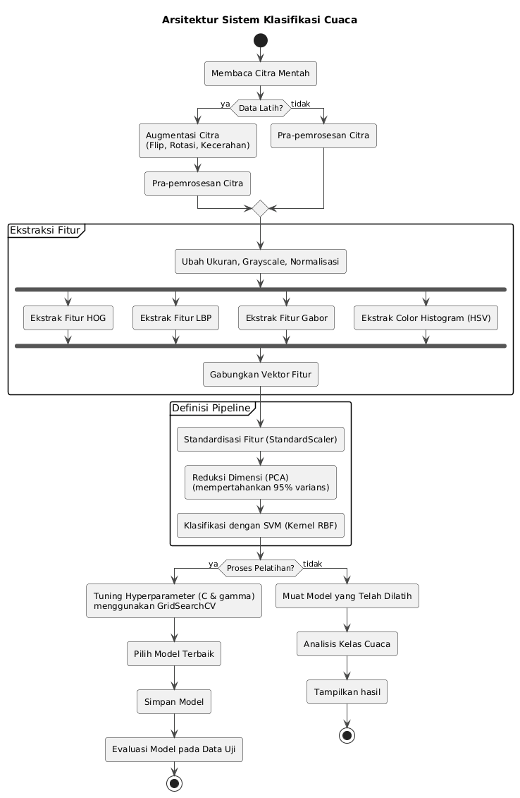

# Arsitektur

---

## Ringkasan
- **Input:** Gambar mentah  
- **Prapemrosesan:** Split, resize, augmentasi, konversi warna  
- **Ekstraksi fitur:** HOG + Color Histogram + LBP + Gabor 
- **Reduksi dimensi:** PCA
- **Klasifikasi:** Model SVM dengan kernel RBF
- **Output:** Label klasifikasi cuaca

---