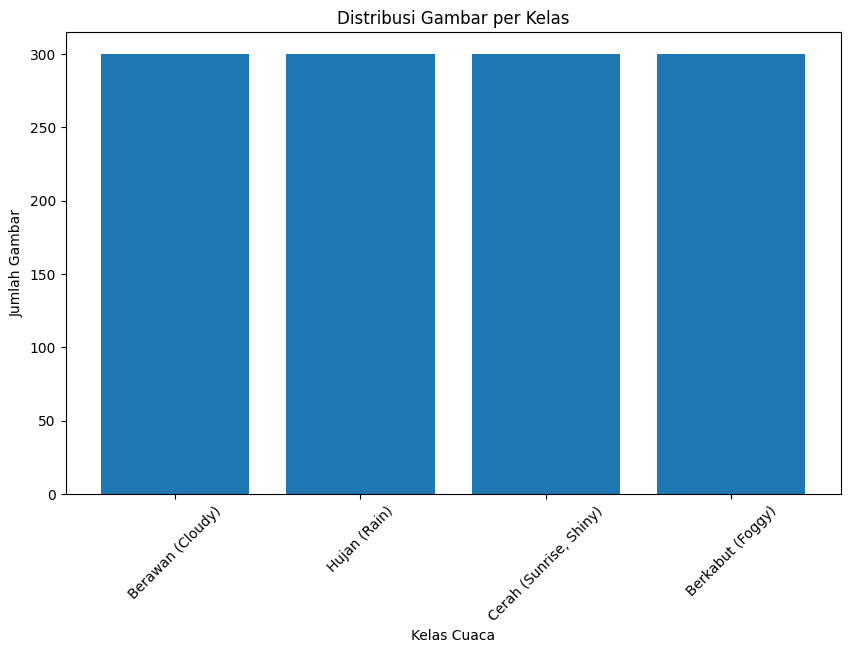

## Sumber & Spesifikasi Dataset

- **Sumber Dataset:** 
  - [multiclass-weather-dataset](https://www.kaggle.com/datasets/pratik2901/multiclass-weather-dataset)
  - [weather-detection-image-dataset](https://www.kaggle.com/datasets/tamimresearch/weather-detection-image-dataset)
  - [weather-dataset](https://www.kaggle.com/datasets/jehanbhathena/weather-dataset)
- **Total Gambar:** 1200 gambar berwarna  
- **Format:** Mayoritas `.jpg`  
- **Jumlah Kelas:** 4 kategori cuaca  
  - **Berawan (Cloudy)**  
  - **Hujan (Rain)**  
  - **Cerah Cerah (Sunrise, Shiny)**  
  - **Berkabut (Foggy)**  

---

## Distribusi Kelas

### Jumlah

| Kelas                   | Jumlah Gambar |
|--------------------------|---------------|
| Berawan (Cloudy)         | 300           |
| Hujan (Rain)             | 300           |
| Cerah (Sunrise, Shiny)   | 300           |
| Berkabut (Foggy)         | 300           |
| **Total**                | **1,200**     |

---
