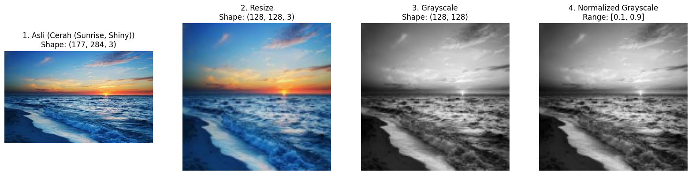
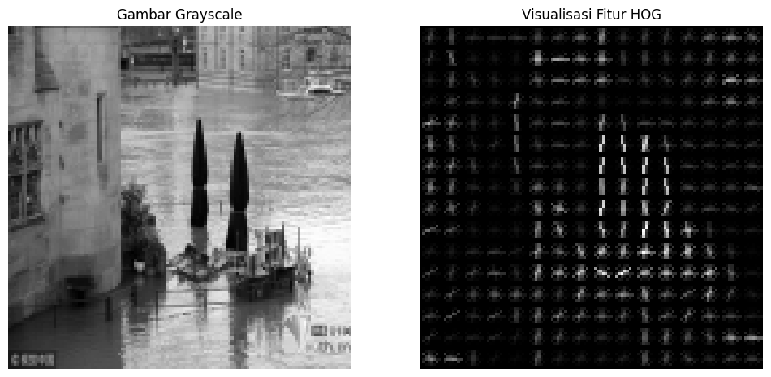
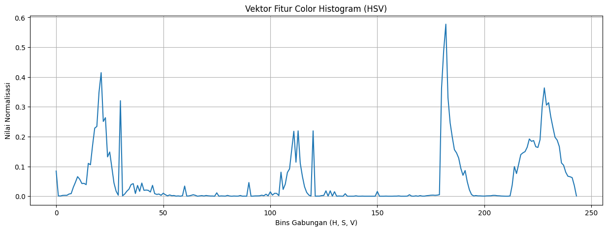
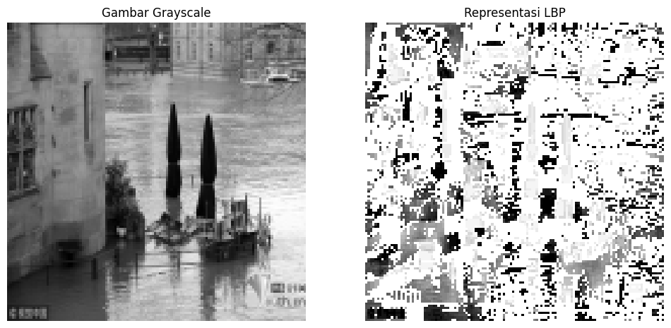
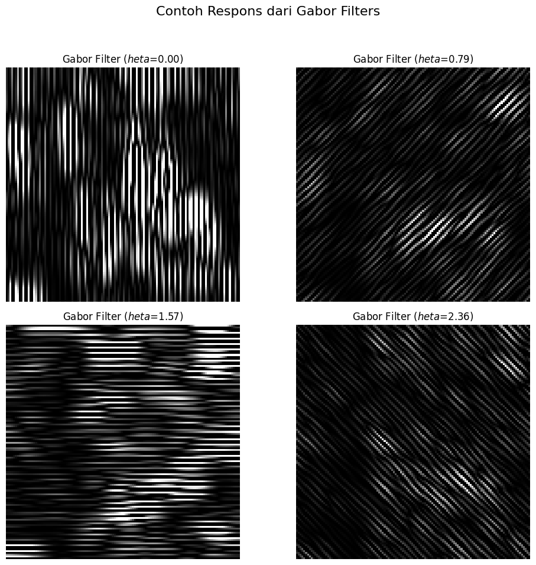

# Metodologi
---

## Pra-pemrosesan

---

## Ekstraksi Fitur (*Feature Extraction*)

Tujuan tahap ini adalah mengubah **data piksel mentah** dari gambar menjadi **vektor fitur numerik** yang ringkas namun informatif.  
Proyek ini menggabungkan **empat metode ekstraksi fitur klasik** untuk menangkap aspek visual yang berbeda.

### a. Histogram of Oriented Gradients (HOG)
- **Apa yang Ditangkap:** Bentuk & kontur objek.  
- **Bagaimana Caranya:** HOG menghitung distribusi arah gradien (perubahan intensitas piksel) di dalam sel-sel kecil gambar. Efektif untuk mendeteksi tepi dan kontur tanpa banyak dipengaruhi pencahayaan.  
- **Peran dalam Proyek:** Membantu membedakan struktur langit, misalnya, bentuk awan tebal **(Berawan)** vs. langit yang lapang **(Cerah)**.
- **Visualisasi:**

### b. Color Histogram
- **Apa yang Ditangkap:** Distribusi warna global dalam sebuah gambar.  
- **Bagaimana Caranya:** Histogram dihitung dalam ruang warna **HSV** (Hue, Saturation, Value) yang lebih robust terhadap pencahayaan dibanding RGB. Hue sangat membantu membedakan palet warna.  
- **Peran dalam Proyek:** Krusial untuk membedakan kondisi **Cerah** yang mengandung palet warna oranye/merah **(sunrise)** dari yang didominasi warna biru **(shine)**.
- **Visualisasi:**

### c. Local Binary Patterns (LBP)
- **Apa yang Ditangkap:** Tekstur mikro atau pola-pola kecil pada permukaan.  
- **Bagaimana Caranya:** LBP membandingkan intensitas tiap piksel dengan tetangganya, menghasilkan deskriptor tekstur yang ringkas dan stabil.  
- **Peran dalam Proyek:** Berguna untuk mengidentifikasi tekstur halus, seperti permukaan awan lembut **(Berawan)** atau detail pada tetesan hujan **(Hujan)**.
- **Visualisasi:**

### d. Filter Gabor
- **Apa yang Ditangkap:** Tekstur pada berbagai skala dan orientasi.
- **Bagaimana Caranya:** Filter Gabor menganalisis frekuensi dan arah tekstur di seluruh gambar, mirip dengan cara sistem visual manusia bekerja. Ini memungkinkan deteksi pola berulang seperti riak air atau barisan awan.
- **Peran dalam Proyek:** Menambah kekayaan informasi tekstur, membantu membedakan kondisi yang mirip seperti **Berawan** dan **Berkabut**.
- **Visualisasi:**

**Vektor Fitur Gabungan:**  
Keempat metode digabung → menghasilkan **8414 dimensi** fitur per gambar.  

---

## Reduksi Dimensi (*Dimensionality Reduction*)

- **Masalah:** Vektor fitur berukuran **8418 dimensi** → terlalu besar → rawan *curse of dimensionality* → overfitting.  
- **Teknik:** **Principal Component Analysis (PCA)**.  
- **Bagaimana Caranya:** PCA memproyeksikan data ke koordinat baru yang memaksimalkan varians. Komponen dengan varians kecil (noise) dibuang.  
- **Implementasi:** PCA dikonfigurasi untuk mempertahankan **95% varians total** → dimensi berkurang drastis sambil menjaga informasi utama.  

---

## Model Klasifikasi

- **Algoritma:** **Support Vector Machine (SVM)**  
- **Mengapa SVM?**  
  - Sangat efektif di ruang berdimensi tinggi  
  - Mampu membentuk batas keputusan kompleks antar kelas  

### Konfigurasi SVM
- **Kernel:** `RBF` → fleksibel untuk pola non-linear pada data visual  
- **Penyeimbangan Kelas:** `class_weight='balanced'` → Memberi bobot yang lebih besar pada kelas minoritas untuk mengatasi ketidakseimbangan dataset.
- **Hyperparameter Tuning:**  
  Dilakukan dengan **GridSearchCV**, mencari kombinasi terbaik:  
  - **C (Regularisasi):** Mengontrol trade-off antara memaksimalkan margin dan meminimalkan kesalahan klasifikasi.
  - **gamma:** Mengatur sejauh mana pengaruh satu sampel data latih.

---