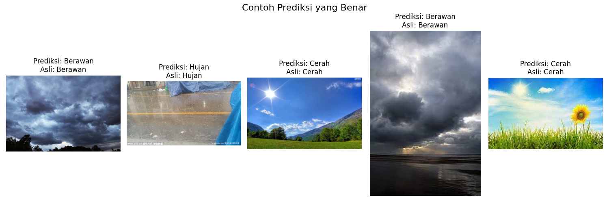

# Hasil

Hasil kuantitatif dari **model klasifikasi cuaca**, dievaluasi pada **240 gambar uji**.

---

## Performa Keseluruhan

Model optimal (Data Augmentation + PCA + SVM dengan 4 Fitur) mencapai performa tinggi dan seimbang di semua metrik

| Metrik                                | Nilai   |
|---------------------------------------|---------|
| **Akurasi Keseluruhan (Data Uji)**    | 89.17%  |
| **Skor F1 Rata-rata (Macro Avg)**     | 0.89    |
| **Skor F1 Rata-rata (Weighted Avg)**  | 0.89    |
| **Parameter Terbaik (C, γ)**          | (0.01, 0.001) |
| **Skor Validasi Silang (CV)**         | 84.77%  |

---

## Laporan Klasifikasi Detail

| Kelas                 | Precision | Recall | F1-Score | Support |
|------------------------|------------|---------|-----------|----------|
| Berawan (Cloudy)       | 0.84       | 0.90    | 0.87      | 60       |
| Hujan (Rain)           | 0.84       | 0.98    | 0.91      | 60       |
| Cerah (Sunrise, Shiny) | 0.92       | 0.78    | 0.85      | 60       |
| Berkabut (Foggy)       | 0.98       | 0.90    | 0.94      | 60       |
| **Total / Accuracy**   | —          | —       | **0.89**  | 240      |
| **Macro Avg**          | 0.90       | 0.89    | 0.89      | 240      |
| **Weighted Avg**       | 0.90       | 0.89    | 0.89      | 240      |

---

## Analisis

- **Performa Terbaik pada Kelas Berkabut (Foggy)** → Kelas ini memiliki F1-Score tertinggi **(0.94)** dan presisi **(0.98)**, menunjukkan model sangat andal dalam mengidentifikasi kondisi berkabut.
- **Recall Tinggi untuk Hujan (Rain)** → Model sangat baik dalam menemukan hampir semua kasus hujan **(98%)**, meskipun presisinya lebih rendah **(84%)**, yang menandakan beberapa kondisi lain salah diklasifikasikan sebagai hujan.
- **Tantangan pada Kelas Cerah (Sunrise, Shiny)** → Recall untuk kelas gabungan ini adalah yang terendah **(78%)**, menunjukkan model masih kesulitan mengidentifikasi beberapa gambar cerah dengan benar.
- **Performa Stabil pada Berawan (Cloudy)** → Kelas ini menunjukkan keseimbangan yang baik antara presisi **(0.84)** dan recall **(0.90)**.

---

## Analisis Error (Potensi Peningkatan)

Walaupun performa sangat tinggi, kesalahan kecil tetap ada, terutama pada kasus gambar yang **ambiguous**:  
- **Mendung sangat gelap** → mirip kondisi hujan.  
- **Cerah dengan sedikit awan** → bisa jadi membingungkan bagi model.  

**Peluang perbaikan:**  
- Menambah lebih banyak data pada kelas dengan recall terendah, yaitu Cerah.
- Melakukan analisis error yang lebih mendalam untuk memahami mengapa gambar Cerah sering salah diklasifikasikan.

---

## Visualisasi Confusion Matrix

---

## Visualisasi Precision Recall Curve

---

## Visualisasi ROC Curve

---

## Contoh Klasifikasi yang Benar

## Contoh Klasifikasi yang Salah

---